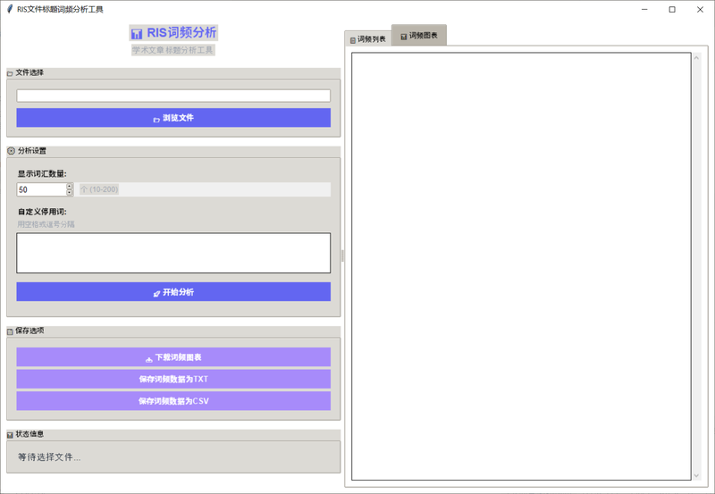

# 📊 RIS Title Word Frequency Analyzer

[](https://www.python.org/downloads/)
[](LICENSE)
[](#安装指南)

一个专门用于分析RIS格式文件中英文学术文章标题的词频分析工具，采用现代化GUI设计，为学术研究者提供便捷的文献标题分析功能。

## ✨ 主要特性

- 🔍 **智能RIS解析**：准确解析RIS文件，支持跨行标题和多种编码格式
- 📊 **专业词频分析**：针对学术文章标题优化的停用词列表和词形规范化
- 🎨 **现代化界面**：直观的GUI设计，实时预览分析结果
- 📈 **可视化图表**：生成专业的词频分布图表，支持多种导出格式
- ⚙️ **灵活配置**：自定义停用词、可调节显示词汇数量（10-200个）
- 💾 **多格式导出**：支持TXT、CSV、PNG、PDF等多种格式
- 🚀 **高性能处理**：多线程处理，支持大型数据集分析

## 📸 界面预览


*现代化的图形用户界面，左侧控制面板，右侧结果展示*

## 🛠️ 安装要求

### 系统要求
- Python 3.7 或更高版本
- Windows 10/11, macOS 10.14+, 或 Linux

### 依赖库
```bash
pip install matplotlib tkinter
```

> **注意**: `tkinter` 通常随Python一起安装，如果遇到问题请参考[安装指南](#安装指南)

## 🚀 快速开始

### 方法一：下载发布版本（推荐）
1. 前往 [Releases](https://github.com/jssdwang06/ris-title-analyzer/releases) 页面
2. 下载最新版本的压缩包
3. 解压后双击 `启动GUI版本.bat`（Windows）或运行 `python ris_title_analyzer_gui.py`

### 方法二：克隆仓库
```bash
git clone https://github.com/jssdwang06/ris-title-analyzer.git
cd ris-title-analyzer
pip install -r requirements.txt
python ris_title_analyzer_gui.py
```

## 📖 使用指南

### GUI版本（推荐）

#### 1️⃣ 启动应用
- **Windows**: 双击 `启动GUI版本.bat`
- **macOS/Linux**: 运行 `python ris_title_analyzer_gui.py`

#### 2️⃣ 导入RIS文件
- 点击"📂 浏览文件"选择您的RIS文件
- 支持从Web of Science、Scopus、PubMed等数据库导出的RIS文件

#### 3️⃣ 配置分析参数
- **显示词汇数量**: 设置要显示的高频词数量（10-200个）
- **自定义停用词**: 添加要过滤的特定词汇（用空格或逗号分隔）

#### 4️⃣ 开始分析
- 点击"🚀 开始分析"按钮
- 程序将自动解析RIS文件并生成词频统计

#### 5️⃣ 查看结果
- **📋 词频列表**: 查看详细的文本统计结果
- **📊 词频图表**: 查看可视化图表

#### 6️⃣ 导出结果
- **📥 下载图表**: 保存为PNG、JPG、PDF或SVG格式
- **保存数据**: 导出为TXT或CSV格式，便于进一步分析

### 命令行版本
适合批量处理和自动化场景：
```bash
python ris_title_analyzer.py
```

## 📋 版本对比

| 特性 | GUI版本 | 命令行版本 |
|------|---------|------------|
| 易用性 | ⭐⭐⭐⭐⭐ | ⭐⭐⭐ |
| 可视化 | ✅ 内置图表 | ❌ 仅文本输出 |
| 自定义停用词 | ✅ 图形界面 | ❌ 需修改代码 |
| 批量处理 | ⭐⭐⭐ | ⭐⭐⭐⭐⭐ |
| 适用用户 | 所有用户 | 技术用户 |

## ⚙️ 配置选项

### 词汇数量设置
| 参数 | 默认值 | 范围 | 说明 |
|------|--------|------|------|
| 显示词汇数量 | 50个 | 10-200个 | 控制分析结果中显示的高频词汇数量 |

**推荐设置**:
- 📄 小数据集（<100篇文献）：10-30个
- 📚 中等数据集（100-500篇）：30-80个
- 📖 大数据集（>500篇）：80-200个

### 自定义停用词
在GUI界面中可以添加特定领域的停用词：
```
示例输入: control, system, data, method, approach
```
- 支持空格或逗号分隔
- 与内置学术停用词列表合并使用
- 实时生效，无需重启程序

## 🔧 技术特性

### 🎯 学术标题专用优化
- **智能停用词过滤**: 过滤学术写作套话（如"based on", "using", "novel approach"）
- **专业术语保留**: 保留有学术价值的专业术语和概念
- **已发表文献优化**: 针对期刊论文标题特点进行优化

### 📝 词形规范化
自动合并词汇的不同形式：
```
systems → system          analyses → analysis
networks → network        studies → study
methods → method          approaches → approach
```

### 🔍 智能文件解析
- **跨行标题支持**: 正确处理分行的长标题
- **多编码兼容**: 自动检测UTF-8和Latin-1编码
- **容错处理**: 处理格式不规范的RIS文件

## 📊 示例输出

### 文本格式结果
```
✨ 词频分析结果
═══════════════════════════════════════════════════════════
📚 解析标题数量: 1,234 个
🔍 高频词汇数量: 50 个

🏆 词频排行榜
────────────────────────────────────────────────────────────
🥇 control                 │  3225 次 
🥈 supervisory             │  3043 次 
🥉 system                  │  1506 次 
 4. event                  │   479 次 
 5. discrete               │   455 次 
```

### 支持的导出格式
- 📊 **图表**: PNG, JPG, PDF, SVG
- 📄 **数据**: TXT（带排行榜格式）, CSV（便于Excel分析）

## 🗂️ 支持的数据源

| 数据库 | 格式支持 | 导出方式 |
|--------|----------|----------|
| Web of Science | ✅ | 导出为RIS格式 |
| Scopus | ✅ | 导出为RIS格式 |
| PubMed | ✅ | 导出为RIS格式 |
| IEEE Xplore | ✅ | 导出为RIS格式 |
| SpringerLink | ✅ | 导出为RIS格式 |

## 🛠️ 安装指南

### Windows
```bash
# 确保已安装Python 3.7+
python --version

# 安装依赖
pip install matplotlib

# 运行程序
python ris_title_analyzer_gui.py
```

### macOS
```bash
# 使用Homebrew安装Python（如果需要）
brew install python

# 安装依赖
pip3 install matplotlib

# 运行程序
python3 ris_title_analyzer_gui.py
```

### Linux (Ubuntu/Debian)
```bash
# 安装Python和tkinter
sudo apt update
sudo apt install python3 python3-pip python3-tk

# 安装matplotlib
pip3 install matplotlib

# 运行程序
python3 ris_title_analyzer_gui.py
```

## 🤝 贡献指南

我们欢迎各种形式的贡献！

### 报告问题
- 使用 [Issues](https://github.com/jssdwang06/ris-title-analyzer/issues) 报告bug
- 提供详细的错误信息和复现步骤

### 功能建议
- 在Issues中提出新功能建议
- 描述使用场景和预期效果

### 代码贡献
1. Fork 本仓库
2. 创建功能分支 (`git checkout -b feature/AmazingFeature`)
3. 提交更改 (`git commit -m 'Add some AmazingFeature'`)
4. 推送到分支 (`git push origin feature/AmazingFeature`)
5. 创建 Pull Request

## 📄 许可证

本项目采用 MIT 许可证 - 查看 [LICENSE](LICENSE) 文件了解详情。

## 🙏 致谢

- 感谢所有贡献者的支持
- 特别感谢学术社区的反馈和建议

## 📞 联系方式

- 🐛 Issues: [GitHub Issues](https://github.com/jssdwang06/ris-title-analyzer/issues)

---

<div align="center">

**⭐ 如果这个项目对您有帮助，请给我们一个星标！**

[](https://github.com/jssdwang06/ris-title-analyzer)

</div>
